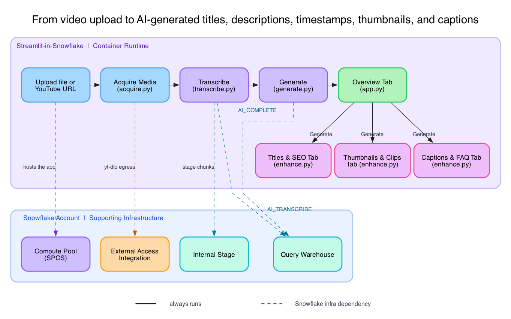
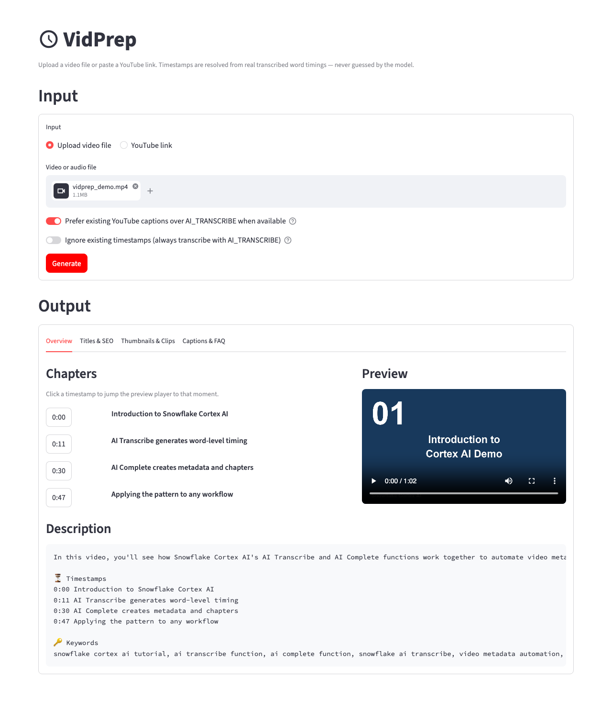
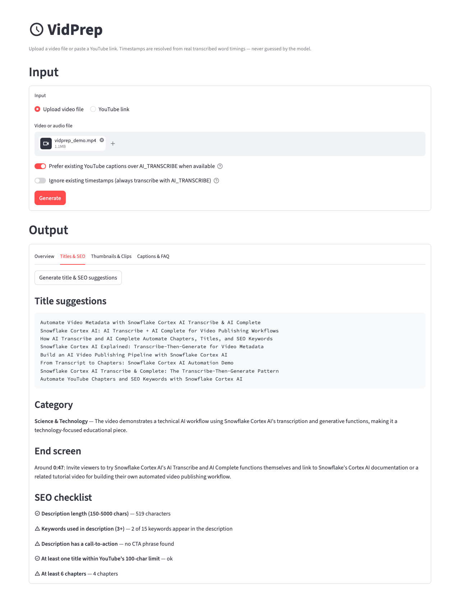
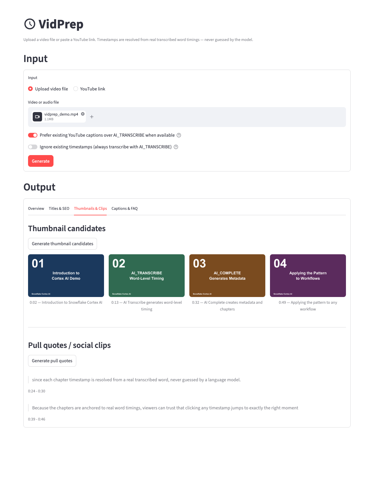
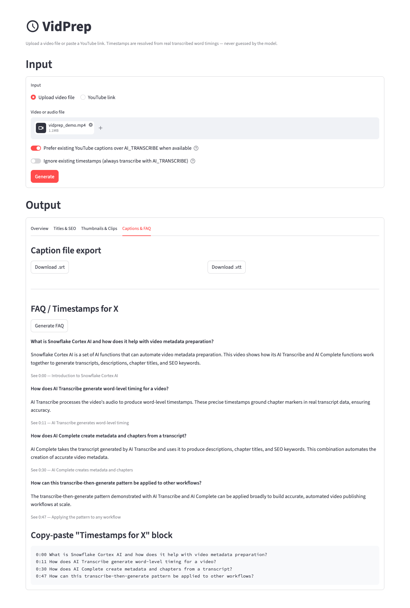
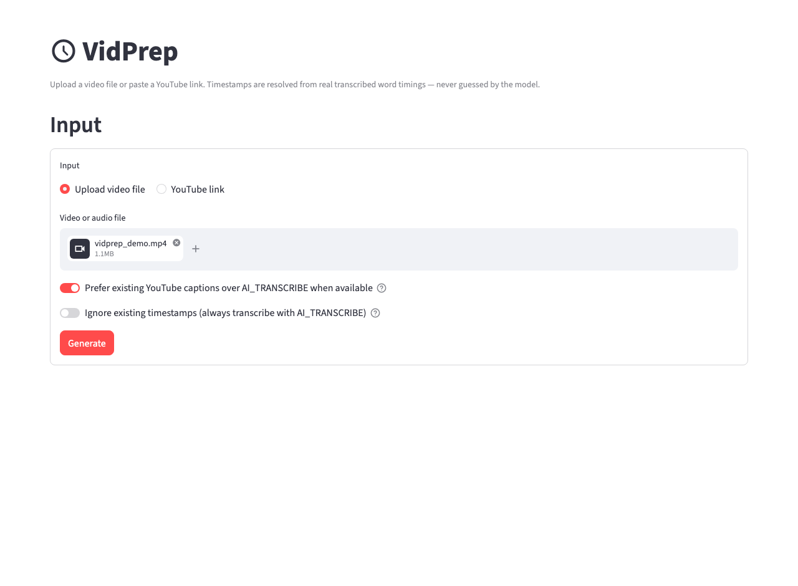

author: Chanin Nantasenamat
id: ai-powered-video-publishing
categories: snowflake-site:taxonomy/solution-center/certification/quickstart,snowflake-site:taxonomy/product/ai,snowflake-site:taxonomy/snowflake-feature/cortex-llm-functions
language: en
summary: Build VidPrep, a Streamlit-in-Snowflake app that uses AI_TRANSCRIBE and AI_COMPLETE to generate word-accurate video chapters, descriptions, SEO metadata, thumbnails, and captions.
environments: web
status: Published
feedback link: https://github.com/Snowflake-Labs/sfguides/issues
fork repo link: https://github.com/sfc-gh-cnantasenamat/sfguide-ai-powered-video-publishing


# Build an AI-Powered Video Publishing App on Snowflake
<!-- ------------------------ -->
## Overview

Creators publishing a video usually have to write a description, mark chapter timestamps, pick SEO keywords, choose a thumbnail, and write captions, all by hand and all after the fact. VidPrep automates this end to end: give it a video file or a YouTube link, and it produces a word-accurate transcript, real (not guessed) chapter timestamps, a description, SEO titles and keywords, thumbnail candidates, pull quotes, caption files, and an FAQ, all backed by Snowflake Cortex.

The core design principle behind VidPrep is that a large language model should never be trusted to emit a timestamp directly, because it can hallucinate one that doesn't correspond to anything said in the video. Instead, the model is only ever asked to point at a position in a real, transcribed word array, and the actual timestamp is looked up in code from that position. This guide walks through that architecture and how to build and deploy the whole app on Snowflake.



### What You'll Learn
- How to use `AI_TRANSCRIBE` to produce word-level timestamped transcripts, including chunking media that exceeds its length limit
- How to use `AI_COMPLETE` with a structured JSON response format to extract chapters, descriptions, and SEO metadata
- Why timestamps should be resolved from real transcript data in code, never generated directly by a model
- How to build a multi-tab Streamlit UI with lazy, cached AI generation per tab
- How to deploy a Streamlit app that needs outbound internet access (via `yt-dlp`) using Snowpark Container Services and an External Access Integration

### What You'll Build
VidPrep, a Streamlit-in-Snowflake app, with:
- An **Overview** tab with generated chapters (clickable, deep-linking into the source video), a video preview, and a copy-paste description block
- A **Titles & SEO** tab with title suggestions, a YouTube category pick, an end-screen suggestion, and a free SEO checklist
- A **Thumbnails & Clips** tab with real extracted thumbnail frames and verbatim pull quotes
- A **Captions & FAQ** tab with downloadable `.srt`/`.vtt` caption files and a generated FAQ









### Prerequisites
- Access to a [Snowflake account](https://signup.snowflake.com/?utm_source=snowflake-devrel&utm_medium=developer-guides&utm_cta=developer-guides)
- A role with privileges to create a warehouse, database, stage, compute pool, network rule, and external access integration (e.g. `ACCOUNTADMIN`, or an equivalent custom role)
- [Snowflake CLI](https://docs.snowflake.com/en/developer-guide/snowflake-cli/index) (`snow`) installed locally
- Python 3.11+ installed locally
- Familiarity with Python and basic SQL

<!-- ------------------------ -->
## Setup

### Create the Snowflake objects
Run the following as a role with sufficient privileges. This creates a dedicated warehouse, database/schema, an internal stage (used to hand media files to `AI_TRANSCRIBE`), a compute pool for the Streamlit container runtime, and two External Access Integrations: one so the app can reach YouTube, and one so the container runtime can install the Python dependencies in `pyproject.toml` from PyPI (container runtime apps have no PyPI access by default).

```sql
-- XSMALL is enough here: the AI_TRANSCRIBE/AI_COMPLETE calls run on Cortex's
-- own compute, not this warehouse, so it only needs to handle staging and metadata queries.
CREATE WAREHOUSE IF NOT EXISTS VIDPREP_WH WAREHOUSE_SIZE = XSMALL;

CREATE DATABASE IF NOT EXISTS VIDPREP_DB;
CREATE SCHEMA IF NOT EXISTS VIDPREP_DB.APPS;

CREATE STAGE IF NOT EXISTS VIDPREP_DB.APPS.VIDPREP_STAGE
  ENCRYPTION = (TYPE = 'SNOWFLAKE_SSE');

CREATE COMPUTE POOL IF NOT EXISTS VIDPREP_COMPUTE_POOL
  MIN_NODES = 1
  MAX_NODES = 1
  INSTANCE_FAMILY = CPU_X64_XS;

CREATE NETWORK RULE IF NOT EXISTS VIDPREP_EGRESS_RULE
  MODE = EGRESS
  TYPE = HOST_PORT
  VALUE_LIST = ('youtube.com', '*.youtube.com', '*.googlevideo.com');

CREATE EXTERNAL ACCESS INTEGRATION IF NOT EXISTS VIDPREP_EAI
  ALLOWED_NETWORK_RULES = (VIDPREP_EGRESS_RULE)
  ENABLED = TRUE;

-- Container runtime apps need this to install pyproject.toml's dependencies
-- from PyPI. SNOWFLAKE.EXTERNAL_ACCESS.PYPI_RULE is a Snowflake-managed
-- network rule, so no separate CREATE NETWORK RULE is needed for it.
CREATE EXTERNAL ACCESS INTEGRATION IF NOT EXISTS PYPI_ACCESS
  ALLOWED_NETWORK_RULES = (SNOWFLAKE.EXTERNAL_ACCESS.PYPI_RULE)
  ENABLED = TRUE;
```

### Clone the project
```bash
git clone https://github.com/sfc-gh-cnantasenamat/sfguide-ai-powered-video-publishing.git
cd sfguide-ai-powered-video-publishing
```

### Review the dependencies
The app's `pyproject.toml` pulls in everything needed, including `yt-dlp` for media acquisition, `imageio-ffmpeg` for a bundled ffmpeg binary (the container runtime has no system ffmpeg), and `deno`, which `yt-dlp` needs as a JavaScript runtime to solve YouTube's signature challenges:

```toml
[project]
name = "vidprep"
version = "0.1.0"
requires-python = ">=3.11"
dependencies = [
    "snowflake-connector-python>=3.3.0",
    "streamlit[snowflake]>=1.57.0",
    "webvtt-py>=0.5.1",
    "yt-dlp[default]>=2026.8.19",
    "imageio-ffmpeg>=0.5.1",
    "deno>=2.9.0",
]
```

### Connect with Streamlit's managed connection
The app never opens its own Snowflake connection. It uses `st.connection("snowflake")`, which reads local secrets during development and the app's embedded identity once deployed (the same code path either way):

```python
"""Snowflake connection helper. Uses Streamlit's managed connection, which
reads `.streamlit/secrets.toml` locally and embedded identity when hosted in
Snowflake (Streamlit in Snowflake). Same code path both places."""

import streamlit as st


def run_query(sql: str, params=None):
    """Execute a single SQL statement and return all rows."""
    cur = st.connection("snowflake").cursor()
    cur.execute(sql, params)
    return cur.fetchall()
```

For local development, create `.streamlit/secrets.toml`:

```toml
[connections.snowflake]
account = "<your_account_identifier>"
user = "<your_username>"
password = "<your_password>"
warehouse = "VIDPREP_WH"
role = "<your_role>"
database = "VIDPREP_DB"
schema = "APPS"
```

> aside negative
> **Important**: `st.connection("snowflake")` sets `snowflake.connector.paramstyle` to `"qmark"` as a side effect. Every SQL statement in this app uses `?` placeholders, never `%s`; mixing in `%s` produces a confusing syntax error at the Snowflake parser, not a Python error.

<!-- ------------------------ -->
## Acquire the Media

`acquire.py` normalizes both input paths (a local upload and a YouTube URL) into one `AcquiredMedia` object that the rest of the pipeline consumes identically.

For YouTube links, `yt-dlp` fetches metadata (title, description, existing chapters, captions) and downloads audio for transcription plus a small local preview video:

```python
def _base_ydl_opts() -> dict:
    """Common yt-dlp options. Uses a real logged-in session's cookies (if
    present) to get past YouTube's bot-detection on datacenter/cloud IPs
    (e.g. Snowflake SPCS); this requires a JS runtime (deno, installed as a
    dependency) to solve YouTube's signature challenges for the default web
    client. Note: don't override player_client here: clients like
    'android'/'tv_embedded' explicitly refuse to use cookies, which would
    silently break authenticated access."""
    opts: dict = {}
    if YOUTUBE_COOKIES_FILE and os.path.exists(YOUTUBE_COOKIES_FILE):
        opts["cookiefile"] = YOUTUBE_COOKIES_FILE
    return opts
```

Two things worth calling out from real-world debugging of this integration:

- **Cloud IPs get bot-detection blocked by YouTube.** Client spoofing (pretending to be a mobile app) does not fix this; the fix is real, logged-in session cookies (exported once locally with `yt-dlp --cookies-from-browser chrome --cookies youtube_cookies.txt` and shipped as an app artifact).
- **Cookies and non-browser clients don't mix.** `yt-dlp`'s `android`/`tv_embedded` clients silently refuse to use cookies, which breaks authenticated access without an obvious error. Stick to the default `web` client, which needs a JavaScript runtime (`deno`) to solve YouTube's signature challenge.

A small, low-resolution preview video is also downloaded for the UI player, muxing a video-only stream with an audio-only stream via `ffmpeg`, since most videos have no single pre-combined file below 360p:

```python
preview_opts = {
    **_base_ydl_opts(),
    "quiet": True,
    "no_warnings": True,
    "format": (
        "bestvideo[height<=240][ext=mp4]+bestaudio[ext=m4a]/"
        "bestvideo[height<=240]+bestaudio/"
        "best[height<=240]/worst[ext=mp4]/worst"
    ),
    "merge_output_format": "mp4",
    "ffmpeg_location": imageio_ffmpeg.get_ffmpeg_exe(),
    "outtmpl": preview_template,
}
```

<!-- ------------------------ -->
## Transcribe with AI_TRANSCRIBE

`transcribe.py` builds a single, global word-level timeline for the media: the ground truth every downstream timestamp is resolved against.

`AI_TRANSCRIBE` has a practical limit on media length when requesting word-level timestamps, so longer media is split into chunks with `ffmpeg`, transcribed independently, and re-based onto one continuous timeline using each chunk's *measured* duration (not the requested split point, which can drift):

```python
def _transcribe_chunk_with_ai_transcribe(chunk_path: str) -> dict:
    """Stage the chunk and call AI_TRANSCRIBE with word-level timestamps."""
    staged_name = put_file(chunk_path, STAGE_FQN)
    sql = (
        f"SELECT AI_TRANSCRIBE(TO_FILE('@{STAGE_FQN}', ?), "
        "OBJECT_CONSTRUCT('timestamp_granularity', 'word'))"
    )
    rows = run_query(sql, params=(staged_name,))
    if not rows or rows[0][0] is None:
        raise TranscriptionError(f"AI_TRANSCRIBE returned no result for {chunk_path}.")
    try:
        run_query(f"REMOVE '@{STAGE_FQN}/{staged_name}'")
    except Exception:
        pass  # cleanup best-effort; not fatal
    return json.loads(rows[0][0])
```

When a YouTube video already has manually-written captions, VidPrep uses those directly instead of calling `AI_TRANSCRIBE`. It's free and instant, at the cost of coarser cue-level (rather than word-level) timing.

<!-- ------------------------ -->
## Generate with AI_COMPLETE

This is the section that enforces VidPrep's core correctness rule. `generate.py` never asks the model for a timestamp. It only asks for a `word_index` into the transcript array it was shown, tagged inline as `[INDEX]word`:

```python
_CHAPTER_SCAN_SCHEMA = {
    "type": "object",
    "properties": {
        "chapter_candidates": {
            "type": "array",
            "items": {
                "type": "object",
                "properties": {
                    "word_index": {"type": "number"},
                    "title": {"type": "string"},
                },
                "required": ["word_index", "title"],
            },
        },
        "chunk_summary": {"type": "string"},
    },
    "required": ["chapter_candidates", "chunk_summary"],
}
```

The actual `AI_COMPLETE` call passes this schema as a structured `response_format`, guaranteeing valid JSON back:

```python
def _ai_complete_json(prompt: str, schema: dict) -> dict:
    sql = "SELECT AI_COMPLETE(?, ?, PARSE_JSON(?), PARSE_JSON(?))"
    model_params = json.dumps({"temperature": 0.2, "max_tokens": COMPLETE_MAX_TOKENS})
    response_format = json.dumps({"type": "json", "schema": schema})
    rows = run_query(sql, params=(COMPLETE_MODEL, prompt, model_params, response_format))
    if not rows or rows[0][0] is None:
        raise GenerationError("AI_COMPLETE returned no result.")
    raw = rows[0][0]
    parsed = json.loads(raw) if isinstance(raw, str) else raw
    return parsed
```

This app uses `claude-sonnet-5` as the `AI_COMPLETE` model (set in `config.py`'s `COMPLETE_MODEL`), configurable to any model your account has access to.

The transcript is scanned in overlapping word-count windows (not the whole thing in one call) so long videos still get even chapter coverage, and every returned `word_index` is validated against the actual transcript length before being trusted:

```python
def _resolve_and_clean_chapters(words, raw_candidates: list[dict]) -> list[Chapter]:
    n = len(words)
    resolved: list[tuple[int, str]] = []
    for c in raw_candidates:
        try:
            idx = int(c["word_index"])
        except (KeyError, TypeError, ValueError):
            continue
        idx = max(0, min(idx, n - 1))
        title = (c.get("title") or "").strip()
        if title:
            resolved.append((idx, title))
    resolved.sort(key=lambda x: x[0])
    # Always start at the true beginning.
    if not resolved or resolved[0][0] != 0:
        resolved.insert(0, (0, "Introduction"))
    ...
```

A second `AI_COMPLETE` call, given the combined per-chunk summaries, writes the description and suggests SEO keywords in the same structured response:

```python
_DESCRIPTION_SCHEMA = {
    "type": "object",
    "properties": {
        "description": {"type": "string"},
        "keywords": {"type": "array", "items": {"type": "string"}},
    },
    "required": ["description", "keywords"],
}
```

<!-- ------------------------ -->
## Add Publishing Extras

`enhance.py` layers eight more publishing-prep features on top of the core pipeline, following the same "never invent, always resolve" rule:

- **Titles, category, and an end-screen suggestion** come from one bundled `AI_COMPLETE` call. The category is constrained to YouTube's fixed list of categories and validated against it in code.
- **A SEO checklist** is pure Python (no model call at all), checking description length, keyword usage, call-to-action presence, title length, and chapter count.
- **Thumbnail candidates** are real JPEG frames extracted with `ffmpeg` at each chapter's timestamp, not AI-generated images.
- **Pull quotes** reuse the same chunked-scan pattern as chapters: the model picks a `start_word_index`/`end_word_index` span, and the quote text is built verbatim from the transcript:

```python
def generate_quotes(media: AcquiredMedia, transcript: Transcript, max_quotes: int = 6) -> list[Quote]:
    ...
    quotes = [
        Quote(
            start_seconds=words[s].start,
            end_seconds=words[e].end,
            text=" ".join(w.text for w in words[s : e + 1]),
        )
        for s, e in all_spans
    ]
    return quotes
```

- **Caption files** (`.srt`/`.vtt`) are built deterministically from the word-level transcript by grouping words into cues, with no model call needed.
- **An FAQ** phrases each chapter as a question, tied back to that chapter's real `start_seconds` by index, never a model-invented timestamp.

<!-- ------------------------ -->
## Build the Streamlit UI

`app.py` wraps the Input controls in a bordered container, then, once a result exists in `st.session_state`, renders the Output section as four tabs. The three "extras" tabs are lazy: each has its own **Generate** button, and results are cached in `st.session_state["extras"]` so switching tabs doesn't lose them or re-trigger a model call:



```python
with tab_titles_seo:
    if st.button("Generate title & SEO suggestions", key="gen_titles_seo"):
        try:
            with st.spinner("Generating title, category, and end-screen suggestions..."):
                extras["titles_seo"] = enhance.generate_titles_seo(media, result, transcript.duration)
        except GenerationError as e:
            st.error(f"Generation failed: {e}")

    titles_seo = extras.get("titles_seo")
    if titles_seo:
        st.subheader("Title suggestions")
        st.code("\n".join(titles_seo.titles), language=None)
```

`st.session_state["extras"]` is reset to an empty dict every time a new video finishes processing, so stale results from a previous run never linger into a new one.

<!-- ------------------------ -->
## Deploy to Snowflake

VidPrep runs on the [Streamlit-in-Snowflake container runtime](https://docs.snowflake.com/en/developer-guide/streamlit/app-development/runtime-environments) rather than the classic warehouse runtime, because it needs outbound internet access (for `yt-dlp`) and a system-level `ffmpeg`, neither of which the warehouse runtime supports.

Define the deployment in `snowflake.yml`:

```yaml
definition_version: 2
entities:
  vidprep:
    type: streamlit
    identifier:
      name: VIDPREP
      database: VIDPREP_DB
      schema: APPS
    query_warehouse: VIDPREP_WH
    runtime_name: SYSTEM$ST_CONTAINER_RUNTIME_PY3_11
    compute_pool: VIDPREP_COMPUTE_POOL
    external_access_integrations:
      - PYPI_ACCESS
      - VIDPREP_EAI
    main_file: app.py
    artifacts:
      - app.py
      - acquire.py
      - generate.py
      - transcribe.py
      - enhance.py
      - cache.py
      - config.py
      - snowflake_conn.py
      - pyproject.toml
      - youtube_cookies.txt
```

The `snowflake.yml` in this repo references the exact object names created in Setup above. If you named any of yours differently, update `identifier.database`, `query_warehouse`, `compute_pool`, and `external_access_integrations` in `snowflake.yml` to match before deploying. Update `config.py`'s `STAGE_FQN` to match the stage you created (`VIDPREP_DB.APPS.VIDPREP_STAGE`), export your own YouTube cookies file (`yt-dlp --cookies-from-browser chrome --cookies youtube_cookies.txt`) into the project directory, then deploy:

```bash
snow streamlit deploy vidprep --connection <your_connection_name> --replace
```

The first deploy resolves and locks Python dependencies inside the container, which can take a few minutes. If you later change `pyproject.toml`, redeploy with `--prune` to clear the stale lockfile left on the stage.

<!-- ------------------------ -->
## Conclusion And Resources

Congratulations! You've successfully built and deployed VidPrep, a Streamlit-in-Snowflake app that turns a raw video into a fully publish-ready package: word-accurate chapters, a description, SEO titles/keywords/category, thumbnail candidates, pull quotes, caption files, and an FAQ, all generated by Snowflake Cortex and verified against real transcript data rather than trusted blindly.

### What You Learned
- How to get word-level timestamped transcripts from `AI_TRANSCRIBE`, including chunking long media
- How to use `AI_COMPLETE`'s structured JSON response format to extract reliable, schema-validated output from an LLM
- Why resolving timestamps from real data in code, rather than trusting a model to emit them, eliminates a whole class of hallucination bugs
- How to deploy a Streamlit app that needs outbound network access using the container runtime, a compute pool, and an External Access Integration

### Related Resources

Documentation:
- [AI_TRANSCRIBE](https://docs.snowflake.com/en/sql-reference/functions/ai_transcribe)
- [AI_COMPLETE](https://docs.snowflake.com/en/sql-reference/functions/ai_complete-single-string)
- [Streamlit in Snowflake](https://docs.snowflake.com/en/developer-guide/streamlit/about-streamlit)
- [External network access in Streamlit in Snowflake](https://docs.snowflake.com/en/developer-guide/streamlit/features/external-access)
- [Runtime environments for Streamlit apps](https://docs.snowflake.com/en/developer-guide/streamlit/app-development/runtime-environments)

Additional Reading:
- [sfguide-ai-powered-video-publishing on GitHub](https://github.com/sfc-gh-cnantasenamat/sfguide-ai-powered-video-publishing)
- [yt-dlp documentation](https://github.com/yt-dlp/yt-dlp)
